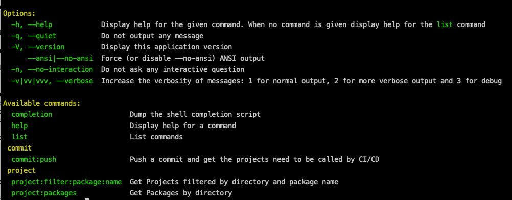

# Repository


Given a folder with Projects

When we push a new commit of an internal project 

Then we need indicate which pipelines need to be executed

### 🖥️ Stack Technology

<p>PHP 8.1</p>

## 🚀 Environment Setup

### 🐳 Needed tools

1. [Install Docker](https://www.docker.com/get-started)
2. Clone this project: `git clone https://github.com/pgrau/repository`
3. Move to the project folder: `cd repository`

### 🔥 Application execution

1. Install and configure all the dependencies and bring up the project executing:
   `make start`

2. Execute the tests executing:
   `make test`

3. Generate the code coverage executing:
   `make coverage`

   The code coverage will be generated in the folder: `metrics/coverage`

4. Generate various metrics executing:
   `make analizer`

   The report will be generated in the folder: `metrics/analizer`

   You will see the complexity of the project in `metrics/analizer/complexity.html`

5. Check possible errors in the code executing:
   `make phpstan`

6. Check the code standard executing:
   `make phpcs`

7. Fix the code standard automatically executing:
   `make fixer`

8. Stop all dockers containers executing:
   `make down`


### 👩‍💻 Project explanation

We have projects in the folder `projects`


We have by default projects 1, 2 and 3, but you can add unlimited projects

We consider is an internal project all projects where the name of composer match with this regular expression:

```
/^pgrau\/[a-z0-9](([_.]?|-{0,2})[a-z0-9]+)*$/
```

### 🔥 Symfony Commands explanation

You can see all available commands executing

```
docker exec -it repo-php bin/console
```



1 - Push a commit and get the projects need to be called by CI/CD

Example:

```
docker exec -it repo-php bin/console commit:push https://github.com/pgrau/1.git c9646197ef43b0e2ff44af61e7f0571526fd4170 main
```

Response:

```
Executing pipeline of project pgrau/2
Executing pipeline of project pgrau/3
```

2 - Get Packages by directory

Example:

```
docker exec -it repo-php bin/console project:packages
```

Response

```
Project pgrau/1
+----------------------------------+---------+------------------------------------------+---------------------------------------------------------+
| Name                             | Version | Reference                                | Url                                                     |
+----------------------------------+---------+------------------------------------------+---------------------------------------------------------+
| psr/container                    | 2.0.2   | c71ecc56dfe541dbd90c5360474fbc405f8d5963 | https://github.com/php-fig/container.git                |
| symfony/console                  | v6.1.1  | 6187424023fbffcd757789aeb517c9161b1eabee | https://github.com/symfony/console.git                  |
| symfony/deprecation-contracts    | v3.1.0  | 07f1b9cc2ffee6aaafcf4b710fbc38ff736bd918 | https://github.com/symfony/deprecation-contracts.git    |
| symfony/polyfill-ctype           | v1.26.0 | 6fd1b9a79f6e3cf65f9e679b23af304cd9e010d4 | https://github.com/symfony/polyfill-ctype.git           |
| symfony/polyfill-intl-grapheme   | v1.26.0 | 433d05519ce6990bf3530fba6957499d327395c2 | https://github.com/symfony/polyfill-intl-grapheme.git   |
| symfony/polyfill-intl-normalizer | v1.26.0 | 219aa369ceff116e673852dce47c3a41794c14bd | https://github.com/symfony/polyfill-intl-normalizer.git |
| symfony/polyfill-mbstring        | v1.26.0 | 9344f9cb97f3b19424af1a21a3b0e75b0a7d8d7e | https://github.com/symfony/polyfill-mbstring.git        |
| symfony/service-contracts        | v3.1.0  | d66cd8ab656780f62c4215b903a420eb86358957 | https://github.com/symfony/service-contracts.git        |
| symfony/string                   | v6.1.0  | d3edc75baf9f1d4f94879764dda2e1ac33499529 | https://github.com/symfony/string.git                   |
+----------------------------------+---------+------------------------------------------+---------------------------------------------------------+
Project pgrau/2
+----------------------------------+-----------+------------------------------------------+---------------------------------------------------------+
| Name                             | Version   | Reference                                | Url                                                     |
+----------------------------------+-----------+------------------------------------------+---------------------------------------------------------+
| pgrau/1                          | main      | 2ec86d5b38d4042135c38ac1ca7649e1be23d449 | https://github.com/pgrau/1.git                          |
| psr/container                    | master    | c71ecc56dfe541dbd90c5360474fbc405f8d5963 | https://github.com/php-fig/container.git                |
| symfony/console                  | 6.2.x-dev | 6187424023fbffcd757789aeb517c9161b1eabee | https://github.com/symfony/console.git                  |
| symfony/deprecation-contracts    | main      | 4912000e79dc2d6df029d35d8755be1ed79b6691 | https://github.com/symfony/deprecation-contracts.git    |
| symfony/polyfill-ctype           | main      | 6fd1b9a79f6e3cf65f9e679b23af304cd9e010d4 | https://github.com/symfony/polyfill-ctype.git           |
| symfony/polyfill-intl-grapheme   | main      | 433d05519ce6990bf3530fba6957499d327395c2 | https://github.com/symfony/polyfill-intl-grapheme.git   |
| symfony/polyfill-intl-normalizer | main      | 219aa369ceff116e673852dce47c3a41794c14bd | https://github.com/symfony/polyfill-intl-normalizer.git |
| symfony/polyfill-mbstring        | main      | 9344f9cb97f3b19424af1a21a3b0e75b0a7d8d7e | https://github.com/symfony/polyfill-mbstring.git        |
| symfony/service-contracts        | main      | 8336f2b06febd99d6309550ccdf4ca4cd054e73a | https://github.com/symfony/service-contracts.git        |
| symfony/string                   | 6.2.x-dev | d3edc75baf9f1d4f94879764dda2e1ac33499529 | https://github.com/symfony/string.git                   |
+----------------------------------+-----------+------------------------------------------+---------------------------------------------------------+
Project pgrau/3
+----------------------------------+-----------+------------------------------------------+---------------------------------------------------------+
| Name                             | Version   | Reference                                | Url                                                     |
+----------------------------------+-----------+------------------------------------------+---------------------------------------------------------+
| pgrau/1                          | main      | 2ec86d5b38d4042135c38ac1ca7649e1be23d449 | https://github.com/pgrau/1.git                          |
| pgrau/2                          | main      | d0a2dd716a50e09a816788a92f04189c64f8888d | https://github.com/pgrau/2.git                          |
| psr/container                    | master    | c71ecc56dfe541dbd90c5360474fbc405f8d5963 | https://github.com/php-fig/container.git                |
| symfony/console                  | 6.2.x-dev | 6187424023fbffcd757789aeb517c9161b1eabee | https://github.com/symfony/console.git                  |
| symfony/deprecation-contracts    | main      | 4912000e79dc2d6df029d35d8755be1ed79b6691 | https://github.com/symfony/deprecation-contracts.git    |
| symfony/polyfill-ctype           | main      | 6fd1b9a79f6e3cf65f9e679b23af304cd9e010d4 | https://github.com/symfony/polyfill-ctype.git           |
| symfony/polyfill-intl-grapheme   | main      | 433d05519ce6990bf3530fba6957499d327395c2 | https://github.com/symfony/polyfill-intl-grapheme.git   |
| symfony/polyfill-intl-normalizer | main      | 219aa369ceff116e673852dce47c3a41794c14bd | https://github.com/symfony/polyfill-intl-normalizer.git |
| symfony/polyfill-mbstring        | main      | 9344f9cb97f3b19424af1a21a3b0e75b0a7d8d7e | https://github.com/symfony/polyfill-mbstring.git        |
| symfony/service-contracts        | main      | 8336f2b06febd99d6309550ccdf4ca4cd054e73a | https://github.com/symfony/service-contracts.git        |
| symfony/string                   | 6.2.x-dev | d3edc75baf9f1d4f94879764dda2e1ac33499529 | https://github.com/symfony/string.git                   |
+----------------------------------+-----------+------------------------------------------+---------------------------------------------------------+
```

3- Get Projects filtered by package name

Example:

```
docker exec -it repo-php bin/console project:filter:package:name pgrau/1
```

Response:

```
+---------+
| Project |
+---------+
| pgrau/2 |
| pgrau/3 |
+---------+
```